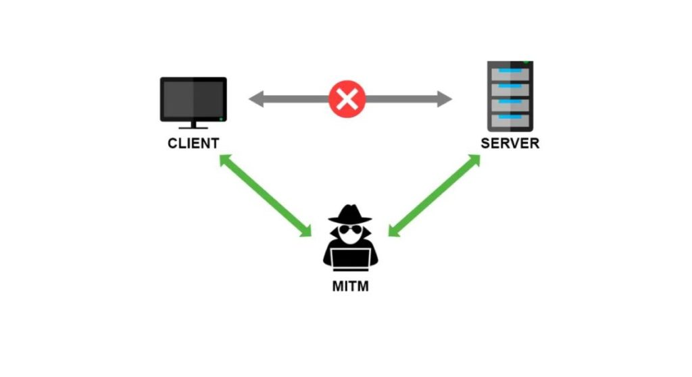

# Man In The Middle
sudo pip3 install scapy  
sudo python3 MITM.py  
(we need sudo mode for the ip forward permission)  

useful cmds to get information:  
ip route show (check the default gateway)  
ifconfig (check the intherfaces)  
ping "broadcast" (check all the active hosts)  
netstat -ano (check the connections)  

{:height="100px" width="100px"}.
